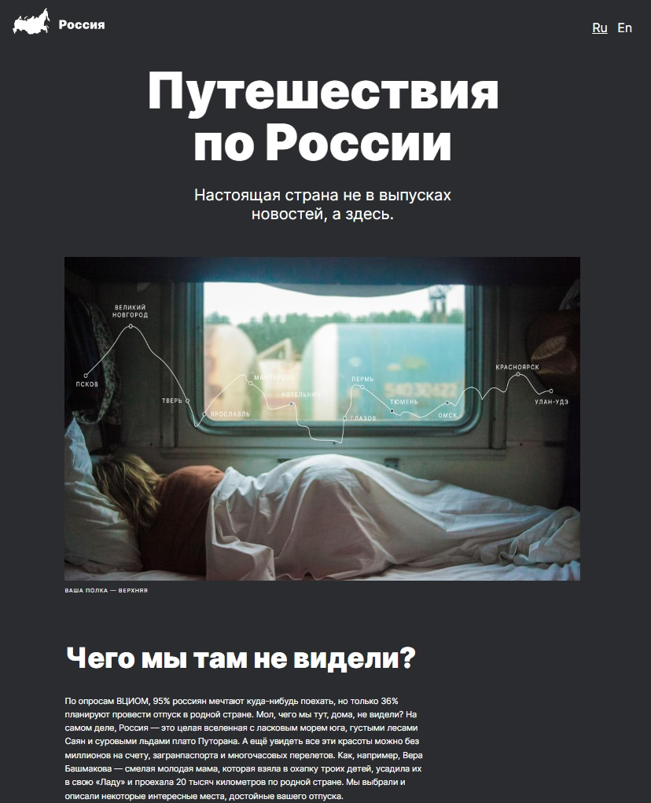

# Проект: Путешествия по России

### О проекте

Это [проект](https://olesia1205.github.io/russian-travel/index.html) о путешествиях по России.
В нем представлена галерея фотографий живописных уголков России, рассказывается о
популярных туристических местах, приводится небольшая сводка о количестве природных заповедников,
объектах природного наследия.

 `Используемые технологии:`

- [x] Верстка сайта с использованием HTML5 и CSS3 по макету из Figma
- [x] Файловая структура проекта БЭМ (Nested)
- [x] Использование Flex и Grid для построения сеток и выравнивания
- [x] Адаптивная вёрстка с использованием @media
- [x] Подключение шрифтов через @font-face

***

 [Ссылка проекта на GitHub](https://olesia1205.github.io/russian-travel/index.html)

